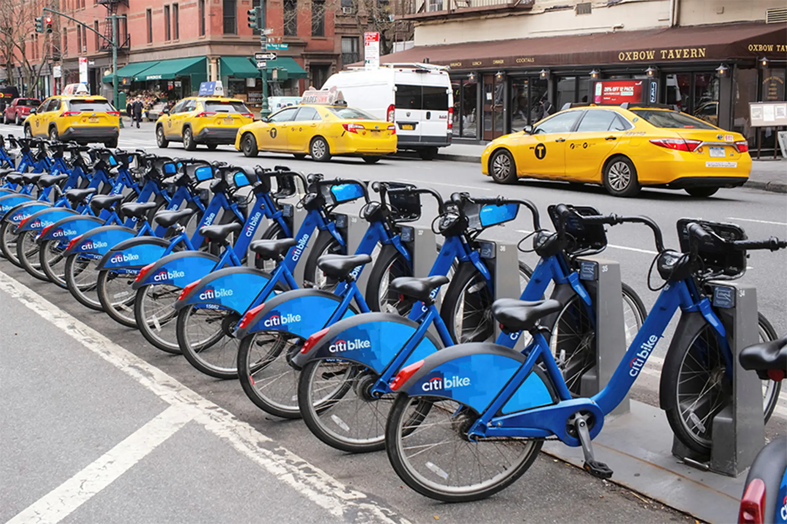
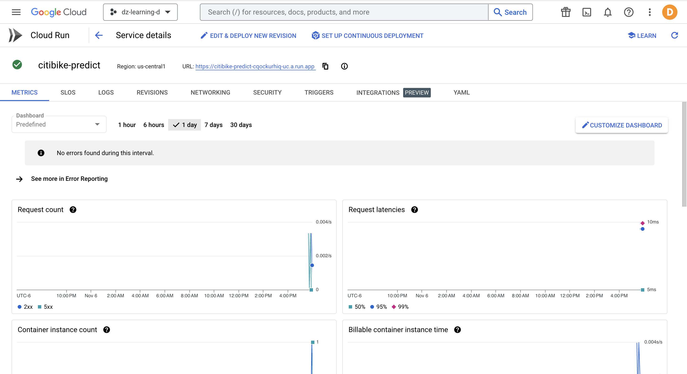
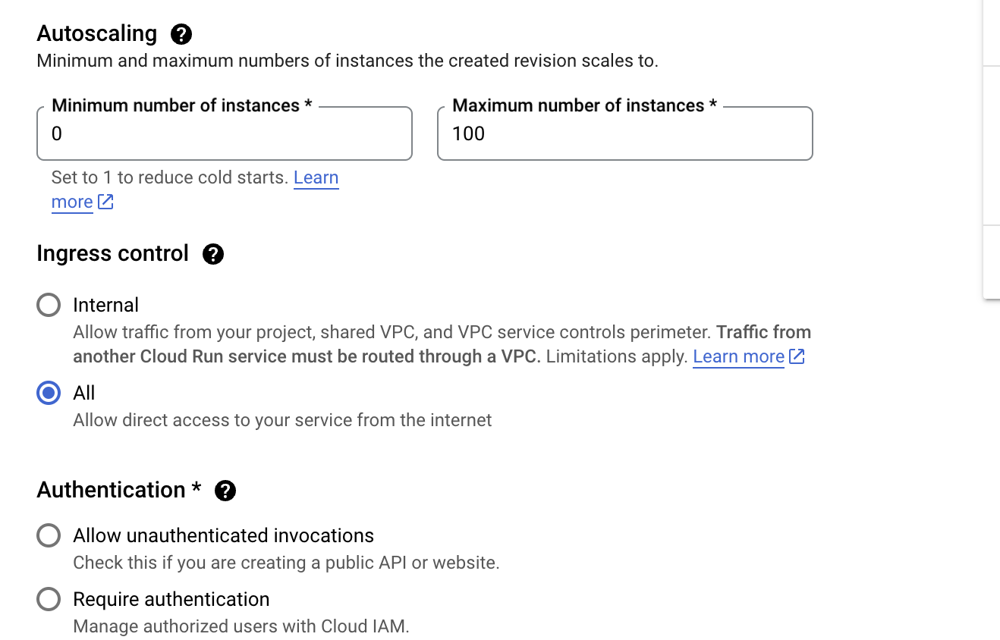
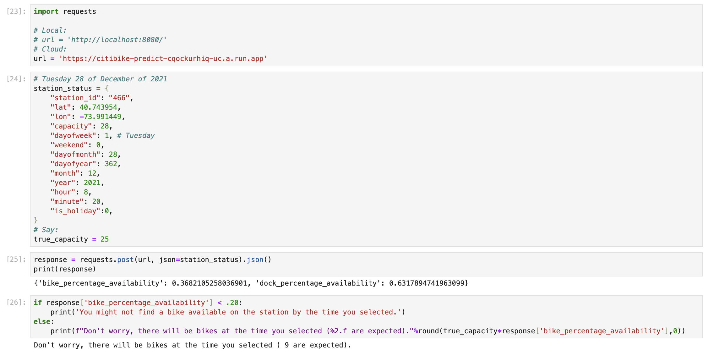
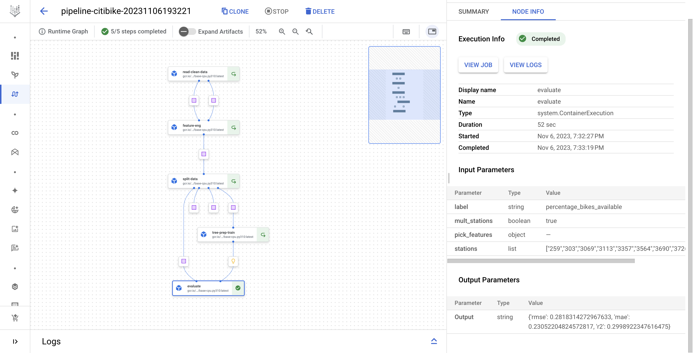
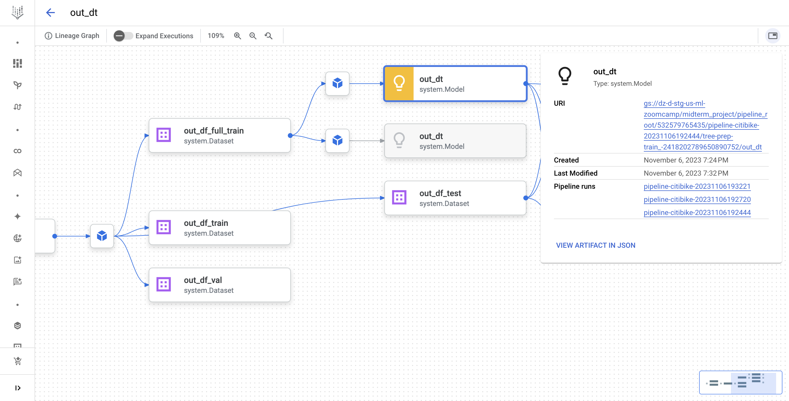

# Citibike Stations ML 🚲 

## 1. About

> Prediction of Bike/Dock Availability

In this project, we will use historic **station status data** (docks available, bikes available @ timestamp) to predict the bike/dock availability at any requested future timestamp. We will be using Google Cloud Platform's services to operationalize training and for model deployment.



Wanna try the end product? Run the Python code:

```python
import requests
url = 'https://citibike-predict-cqockurhiq-uc.a.run.app'

station_status = {
    "station_id": "466",
    "lat": 40.743954,
    "lon": -73.991449,
    "capacity": 28,
    "dayofweek": 1, # Tuesday
    "weekend": 0,
    "dayofmonth": 28,
    "dayofyear": 362,
    "month": 12,
    "year": 2021,
    "hour": 8,
    "minute": 20,
    "is_holiday":0,
}

response = requests.post(url, json=station_status).json()
print(response)
```
Output: 

```
{'bike_percentage_availability': 0.3682105258036901, 'dock_percentage_availability': 0.6317894741963099}
```

I will leave the Cloud Run Endpoint running for the next couple of days.

## 2. Instructions to Recreate Code Yourself ...

### 2.1 Set Environment
To run the notebooks, training, and deployment pieces of the project:
1. Clone the repository:
    ```
    git clone https://github.com/datasciencedani/citibike-stations-ml.git
    ```

1. Ensure environment with `pipenv`:
    ```
    pip install pipenv
    ```
    ```
    pipenv install -r requirements.txt
    ```
    ```
    pipenv shell
    ```
1. Create a jupyter kernell for the environment:
    ```
    python -m ipykernel install --user --name=env-ml-citibike
    ```

### 2.2 Run the Notebooks

> To run this notebooks select the `env-ml-citibike` kernel in your jupyter lab notebook.

1. [Data Cleaning](nbs/00_data_cleaning.ipynb): notebook where we talk about the data we will be using ([Kaggle Citi Bike Stations](https://www.kaggle.com/datasets/rosenthal/citi-bike-stations/)) and perform several steps to clean the dataset and create the label we will use for prediction (`bike/dock percentage availability`).
2. [Feature Engineering & EDA](nbs/01_feature_eng.ipynb): notebook where we perform an exploratory analysis on our dataset (availability over stations and over different days/times of the day), and prepare our features for future modeling.
3. [Training](nbs/02_training.ipynb): notebook where we perform model training and hyperparameter tuning to find the best tree-based model that accommodates our data 
    > Disclaimer🚨: the resulting model does not perform as expected, but serves as a proof of concept of what can be done. We expect to improve the performance of our predictions by trying different architectures (deep learning - next topic) and also by improving our features (adding weather data and transformations to our time variables).

### 2.3 Model Deployment

To deploy the resulting model to a Cloud endpoint:

1. Build the docker container in the `docker/` directory:
    ```
    cd docker
    docker build -t citibike-test .
    ```
1. Run the container exposing the prediction port:
    ```
    docker run -it --rm -p 8080:8080 citibike-test
    ```
1. Run code in `predict_test.ipynb`.

Additional steps to deploy to the Cloud ☁️ (Google Cloud Platform) using two services called Cloud Build and Cloud Run (for more information watch the video [How To Deploy ML Models With Google Cloud Run](https://www.youtube.com/watch?v=vieoHqt7pxo):

1. Make sure to have a [GCP project created](https://developers.google.com/workspace/guides/create-project). 

1. Follow [these instructions](https://cloud.google.com/sdk/docs/install-sdk) to install and initiate the Google Cloud CLI (Command Line Interface) `gcloud`.

1. Go to `docker/Dockerfile` and uncomment the needed lines and then run in the command line:
    ```
    gcloud builds submit --tag gcr.io/<project_id>/predict
    ```
    ```
    gcloud run deploy --image gcr.io/<project_id>/predict --platform managed
    ```
    Now, we have our service in the Cloud:
    
    For serious deployment, you can also configure your service options:
    

1. The final step is making predictions with the new Service URL (you can also use `predict_test.ipynb`):
    

### 2.4 Operational Training (Vertex Pipeline)
> This code substitutes the required `training.py` file. Instead of having one training file, we have a modular, scalabale, and portable **training pipeline**.



To achieve this we converted our notebooks to a structured set of scripts (`src/` directory):
- **Components (`src/components/`):** python scripts containing the modular code to [0] read data the data and clean it, [1] engineer our timestamp variables, [2] split the data, [3] train a decision tree model, and [4] evaluate the model in the testing dataset.
- **Pipeline (`training_pipeline.py`):** placing all the components together (input-outputs).
- **Run pipeline (`run_pipeline.ipynb`):** reads the pipeline, compiles it, and runs it using the Vertex AI SDK.

One great thing about pipelines is that you can automatically keep track of the lineage of the artifacts each run generates (ex. which data generated which models).


To create our training pipeline we use the Vertex AI pipeline service (read more on [Build a Pipeline Docs page](https://cloud.google.com/vertex-ai/docs/pipelines/build-pipeline)), which is Google Cloud's managed [Kubeflow](https://www.kubeflow.org/docs/components/pipelines/v2/introduction/) (Machine Learning Pipeline framework based on Kubernetes). 

You can create your own run of the pipeline by using the `run_pipeline.ipynb` file, make sure to create an `.env` file on your root directory with the variables:
```
# GCP:
PROJECT_ID=
BUCKET_NAME= 
USER=
LOCATION=
SERVICE_ACCOUNT=
```

If you're not familiar with GCP, here are some links to:
1. [Create a GCP project](https://developers.google.com/workspace/guides/create-project).
1. [Create a GCS Bucket](https://cloud.google.com/storage/docs/creating-buckets).
1. [Configure project and Service Account for Vertex Pipelines](https://cloud.google.com/vertex-ai/docs/pipelines/configure-project#service-account).


## 3. Next Steps
1. Try different model architectures and new features.
1. Deploy the model to a Vertex AI endpoint instead of Cloud Run (see [Deploy a model with Flask on GCP Vertex AI](https://medium.com/nlplanet/deploy-a-pytorch-model-with-flask-on-gcp-vertex-ai-8e81f25e605f=).
1. Adapt pipeline to add deployment components after training (with evaluation condition). See the [Step-by-Step Guide to Creating and Deploying Custom ML Pipelines with GCP Vertex AI ](https://medium.com/@wardarahim25/step-by-step-guide-to-creating-and-deploying-custom-ml-pipelines-with-gcp-vertex-ai-part-2-3be6e314bc48) article and the [Vertex AI: Use custom prediction routines with Sklearn to preprocess and postprocess data for predictions](https://codelabs.developers.google.com/vertex-cpr-sklearn#5) lab.